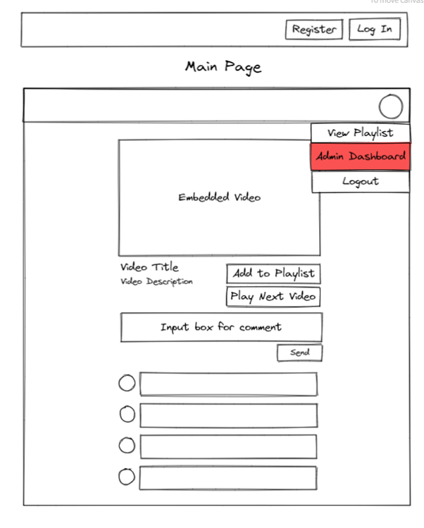
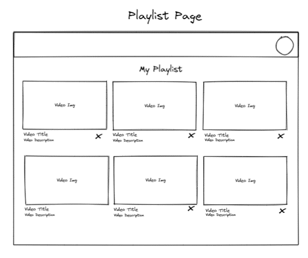
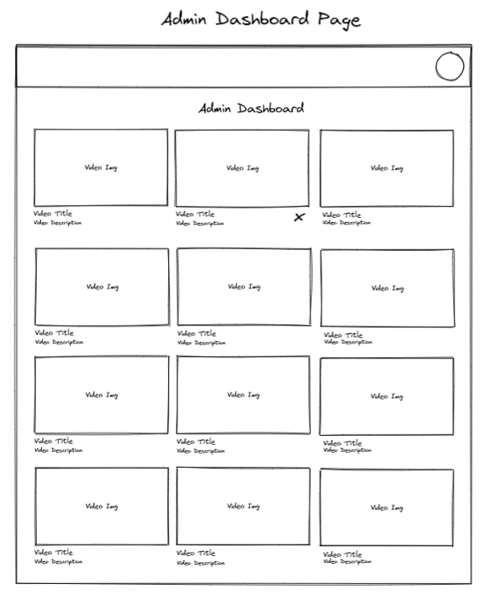
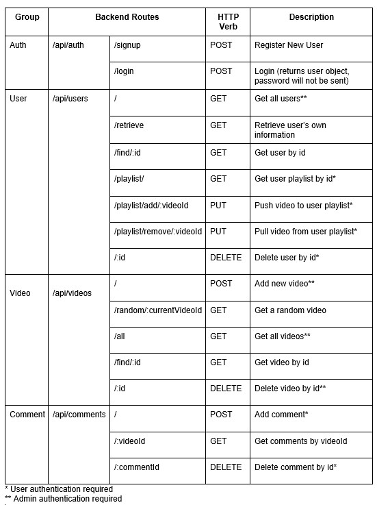

# Tranquil Tube

This is a MERN stack web application created for General Assembly’s Software Engineering Immersive Program. This is the frontend repository of the application. The backend repository can be found [here](https://github.com/charmainelhm/ga-project3-backend).

Tranquil Tube is a video platform specifically created to help user relief stress. The unique thing about this application is that there is no search function at all. When a user first accesses the site, a video meant to relieve stress will be automatically displayed on the page. Users can choose to watch another video by clicking on the “Play next video” button and another video will be displayed on the page. A logged in user can also save videos to his/her playlist so that they can go back to them in the future. They can also leave a comment about a video under the comment section provided.

### Technical Used

These are the cool friends that helped made my application possible

Frontend:

- [React](https://reactjs.org/)
- [React Router](https://reactrouter.com/en/main)
- [Styled Components](https://styled-components.com/)
- [Material UI Icons](https://mui.com/material-ui/material-icons/)
- [Redux Toolkit](https://redux-toolkit.js.org/)
- [Axios](https://axios-http.com/)

Backend:

- [Node.js](https://nodejs.org/en/)
- [Express](https://expressjs.com/)
- [Mongoose](https://mongoosejs.com/)
- [JWT Token](https://jwt.io/)

Databse:

- [MongoDB](https://www.mongodb.com/home)

### Installation Instructions

All the necessary libraries needed for the web application to run are found in the package.json file provided. Install them using <code>npm install</code> if you are using node package manager.

If you wish to run the backend server with your own database, you will need to link your database to the server for it to run properly.

## Development Process

### User Stories

Firstly, the important features of the web application were determined having these user stories in mind:

    User Story 1: As someone who is stressed out I want to have a quick and easy way to relief stress so that I can recharge and get back to work with a clearer mind.
    User Story 2: As an admin of the application, I want to make changes to the database so that the application can continue to provide relevant content to the users.

From there, these are some of the main features that our web application should have:

- Randomised stress relief video, so that users do not have to decide what they have to watch
- Function to allow users to save videos they like
- Admin dashboard for admins to have control of the application

### Wireframes

Simple wireframes were then developed to accommodate to all the features the application should have:

### Server Routes

A backend server was created to help with authenticating users and send the web application video data required for the video to be displayed properly on the application. With the main features in mind, below are routes we came up with for the server:

### Problems Encountered

- Sending cookie to deployed server for authentication
  - The original plan was for cookies sent in the request header to server routes that require authentication. While it worked when we were testing it with the server running locally on our computer, we were unable to send the cookies to the deployed server. Despite looking up online and consulting our instructor for possible cause of the issue, we were unable to determine why the phenomenon was happening.
  - With the help of our instructor, we altered the request header so that we are sending the JWT token directly in the header rather than relying on the cookie to send over the token, which helped solve the authentication issue.

### Future Development

- Allow registered user to upload their own stress relief videos onto the platform
- Like/Dislike Functionality
  - Display videos base on the popularity of the videos
- More functions on the admin dashboard
  - Allow admin to make changes to the video, not just deleting them
